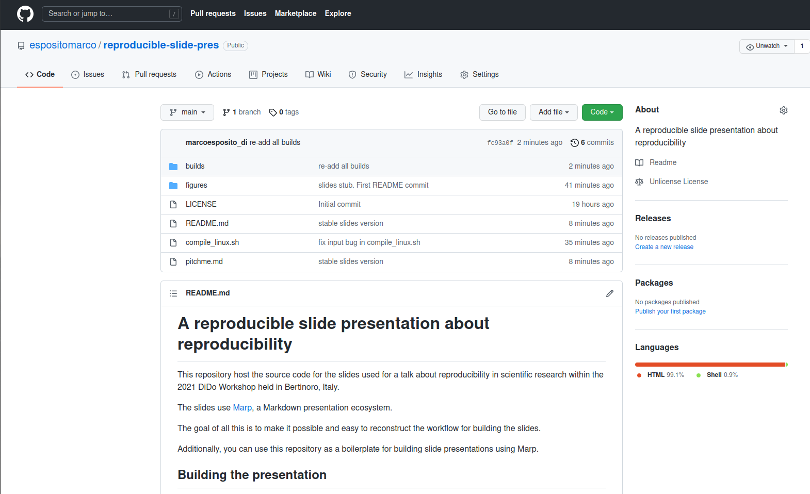

# Reproducibility in Scientific Research
### We're doing it wrong

#

##### Marco Esposito


---
## What are we talking about?

(According to ACM)

* Repeatability: same team, same setting
* Reproducibility: different team, same setting
* Replicability: different team, different setting

---
## What reproducibility can do for the others

* Colleagues/students
* Reviewers
* The research community
* The world!

---
## What reproducibility can do for you

* Better control over your workflow
* Higher confidence in your results
* Quicker prototyping
* Reproducible research gains more attention

* Think of yourself in five years' time as *a different person*

---
## Tricks of the trade

* Git: Commit _before_ experiments and tag the results
* Build a "script cascade" (using configuration files)
  * One "root" ```run.sh``` script
  * Several child scripts (```figure1.sh```, ```exp1.sh```, ...)
* Provide a container image (please!)
* TELL ME YOUR RANDOM SEED(s)
* And infinitely many others
  * ```pip```/```conda```/```maven```
  * notebooks
  * Automatic LaTeX report generation

---
## Conclusions

* _Design_ your workflow to be reproducible
* Don't be lazy
* YOU FORGOT THE RANDOM SEEDS

---
## One more thing...

---


---

